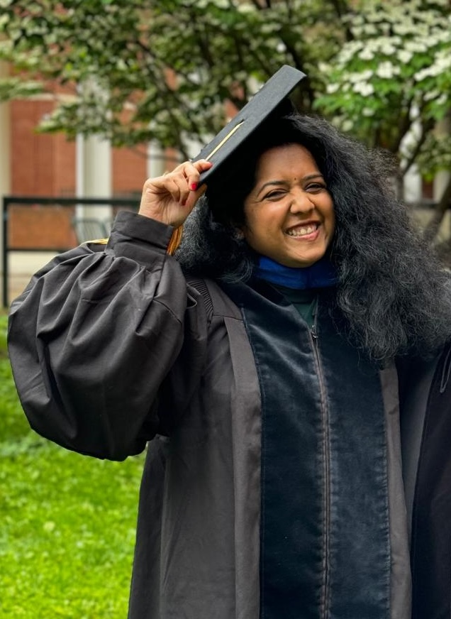

  

Bioinformatics scientist with 10 years of experience in analyzing large-scale multi omic data (genomics, epigenomics and transcriptomics) generated from human subjects diagnosed with cancer. Experience working in highly collaborative environments. Passionate coder . A perfect blend of experience in informatics , biological sciences and translation research.
